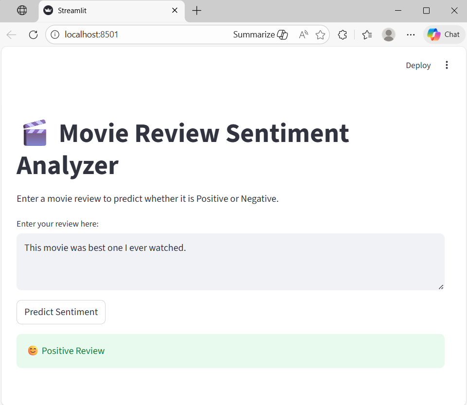
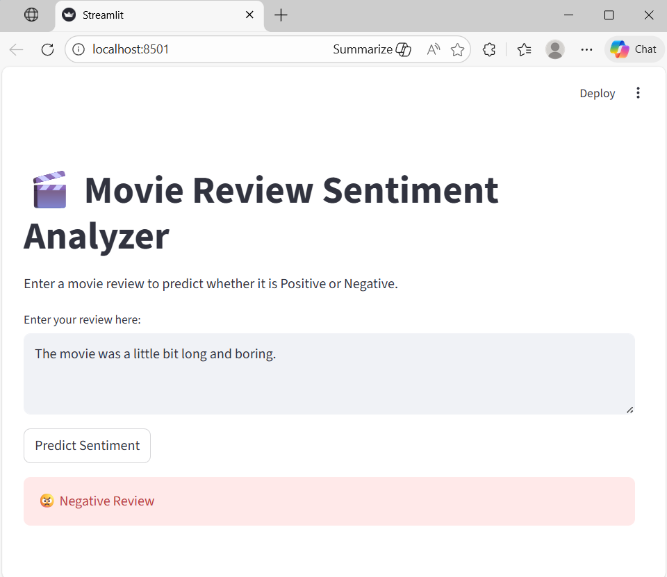

# Movie Review Sentiment Analysis

This project performs sentiment analysis on IMDb movie reviews using deep learning and natural language processing.

## Project Overview
The model analyzes movie reviews and classifies them as positive or negative.

## Technologies Used
Python  
TensorFlow / Keras  
Natural Language Processing

## Dataset
IMDb Movie Reviews Dataset

## Sample Output
Example prediction:

Review: "This movie was amazing and emotional."

Prediction: Positive

## Output Results

### Output 1

### Output 2

## Author
Blessy John
